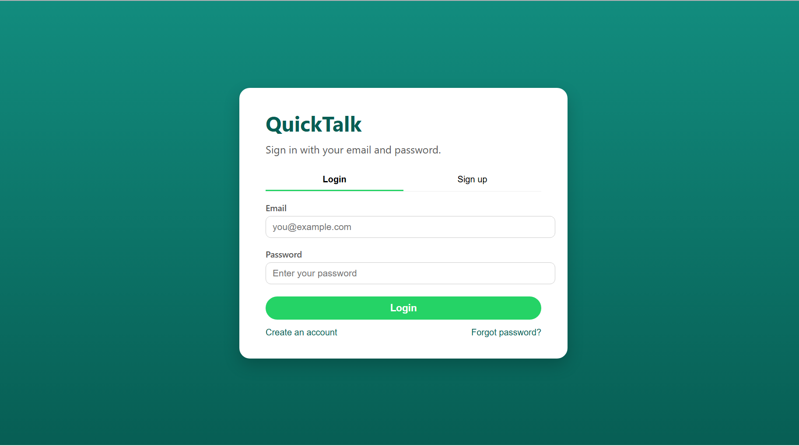
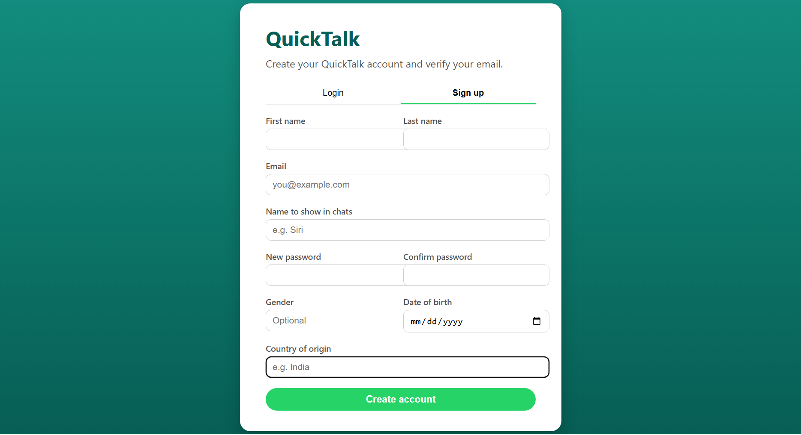
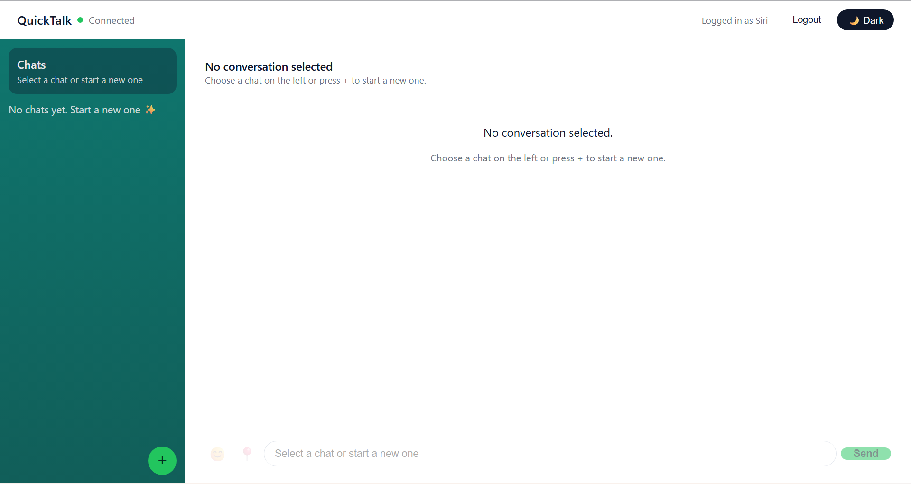

# QuickTalk – Real Time Chat Demo
QuickTalk is a small full stack chat app I’m building to practice modern web development and real-time messaging.  
It has a WhatsApp-style layout, supports private one-to-one chats, and uses WebSockets so messages show up instantly.

## Features
- Sign up with email, chat name, password
- Email OTP verification on first signup (OTP logged in backend for now)
- Login with email + password
- One-to-one private chats
- WebSocket-based real-time messaging (STOMP)
- Sidebar with recent chats and last message preview
- Message bubbles with date/time separators
- Light / dark theme toggle
- Docker Compose for backend, frontend, and DB

## Tech Stack
**Frontend**
- React, TypeScript, Vite  
- STOMP client over WebSocket

**Backend**
- Java, Spring Boot  
- STOMP over WebSocket  
- REST APIs for auth and message history  
- MySQL (or compatible relational DB) via JPA

**Infra**
- Docker  
- Docker Compose
  
# How to Run (with Docker)
### Prerequisites
- Git
- Docker and Docker Compose installed and running

# Steps
1. **Clone the repo:**
   git clone https://github.com/Saisirimallipeddi333/quicktalk_full_stack_demo.git

2. **Go into the project folder:**
   cd quicktalk_full_stack_demo

3. **Start backend + frontend with Docker:**
   docker compose up --build

4. **Open the app in your browser:**
   http://localhost:5173   (or whatever port your frontend uses)

   ## Screenshots

